## 3.0 Результаты опросов*

\*Под данными опросов подразумеваются любые отзывы.

Использованные источники отзывов представлены в таблице ниже:

| Источник    | Ссылка                                                                                                                                                          | Кол-во отзывов | Описание взаимодействия                                                                                                 |
| ----------- | --------------------------------------------------------------------------------------------------------------------------------------------------------------- | -------------- | ----------------------------------------------------------------------------------------------------------------------- |
| Google Play | [ссылка](https://play.google.com/store/apps/details?id=ru.barsopen.mydiary)                                                                                     | 11462          | Для парсинга был создан [jupyter notebook](https://colab.research.google.com/drive/1UxmrBLPBk3MNvknQ_aRA9r708EPGqh270). |
| Мой опрос   | [результат](https://docs.google.com/spreadsheets/d/16-kXZ-XDHGu2iREyn_NIA_hhYDcNUjiGkKlweejBF9k/edit?usp=sharing) [анкета](https://forms.gle/uwtCjn1eE2Y93Ecp8) | 45             | Для парсинга был создан [jupyter notebook](https://colab.research.google.com/drive/1UxmrBLPBk3MNvknQ_aRA9r708EPGqh270). |
| Отзовик     | [ссылка](https://otzovik.com/reviews/elektronniy_dnevnik_moy_dnevnik-prilozhenie_dlya_android/)                                                                 | 11             | Ручная обработка.                                                                                                       |
| App Store   | [ссылка](https://apps.apple.com/ru/app/%D0%BC%D0%BE%D0%B9-%D0%B4%D0%BD%D0%B5%D0%B2%D0%BD%D0%B8%D0%BA/id557094374)                                               | 10             | Ручная обработка.                                                                                                       |
| irecommend  | [ссылка](https://irecommend.ru/content/kompyuternaya-programma-moi-dnevnik)                                                                                     | 2              | Ручная обработка.                                                                                                       |

Итого, мы имеем такие графики:

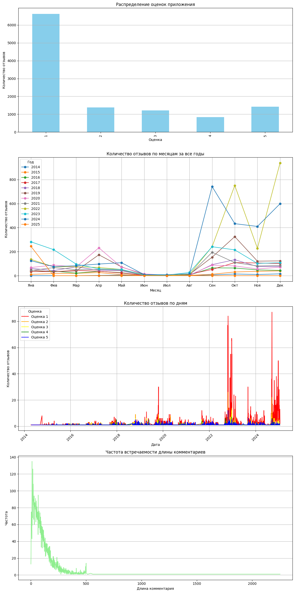

## 3.1 Защита данных/конфиденциальность

Для ответа на вопрос "А зачем вообще нужен этот проект?" или "Что не так с текущим сайтом/приложением дневника?" нужно "вернуться назад во времени", благо [архивные копии](https://web.archive.org/web/20140615000000*/es.ciur.ru) сайта нам это позволяют!


Так выглядела авторизационная страница сайта в 2014 году, да немного кривовато выглядит. НО во первых это 2014 год, во вторых наверняка все еще на стадии прототипирования, а в третьих сейчас эта же страница сайта выглядит так (спустя 11 лет):


### Что же изменилось? 

- Добавлена регистрация через ЕСИА (Единая Систем Идентификации и Аутентификации) для детей, которым исполнилось 14 лет, потому что только после 14 лет можно получить паспорт и соответственно зарегистрировать учетную запись на госуслугах (это единственный возможный вариант входа для детей, которым исполнилось 14 лет).

> - Но по прежнему существует авторизация по логину и паролю.
>
> Я думаю не стоит объяснять то, насколько это большая дыра в безопасности. Практики социальной инженерии (в частности фишинг), которые наиболее эффективны в связи с возрастом целевой аудитории (дети 7-14 и их родители), атаки типа XSS, суть которых заключается в подмене cookie, путем подмены межсайтовых запросов. На первый взгляд может показаться что: "в краже аккаунта нет ничего страшного, там ведь нет ничего кроме оценок". Да, возможно вы правы, но все равно, мне было бы не приятно, если бы кто-то получил доступ к моему аккаунту. Данные, которые сможет получить злоумышленник.
>
> 
>
> Мы можем избавиться от этих проблем используя 2FA (2-х факторная аутентификация), для авторизации, например, через СМС/звонку на телефон или письму на электронную почту.
>
> Можно реализовать настройку этой функции (так как это слишком долго для некоторых людей), для людей которым важна безопасность.

> **В сентябре 2024 года, этот пункт стал неактуален, так как убрали авторизизацию по системе логин/пароль** (или нет, см. дальше).
>
> Но и тут разработчик умудрился допустить ошибку.
> Во время анализа исходного кода страницыавторизации [es.ciur.ru](https://es.ciur.ru) я заметил кое что интересное:
>
> В `HTML` есть поля для ввода логина и пароля.
>
> 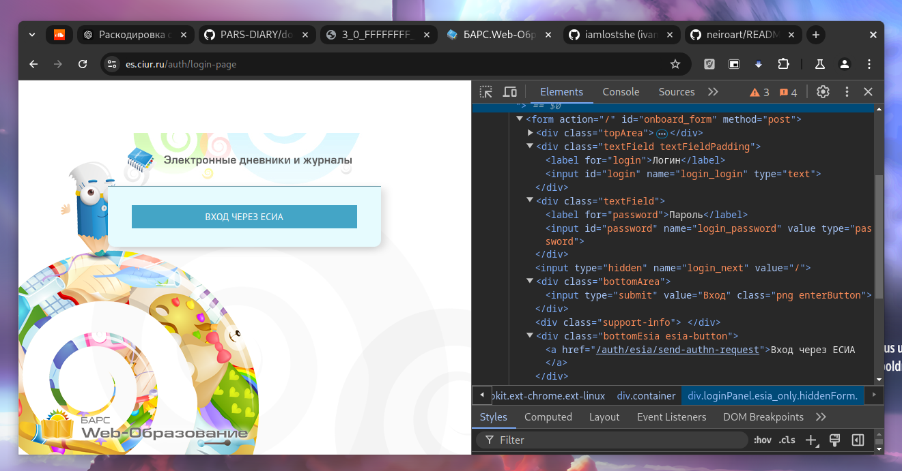
>
> Они просто отключены через `CSS` свойство `display: none;`, что является плохой практикой как минимум по 2-м причинам:
>
> 1. Захламление (отсутствие оптимизации).
>
> 2. Любой пользователь может открыть их просто нажав на галочку в инструментах для разработчиков, что я и сделал:
>
> 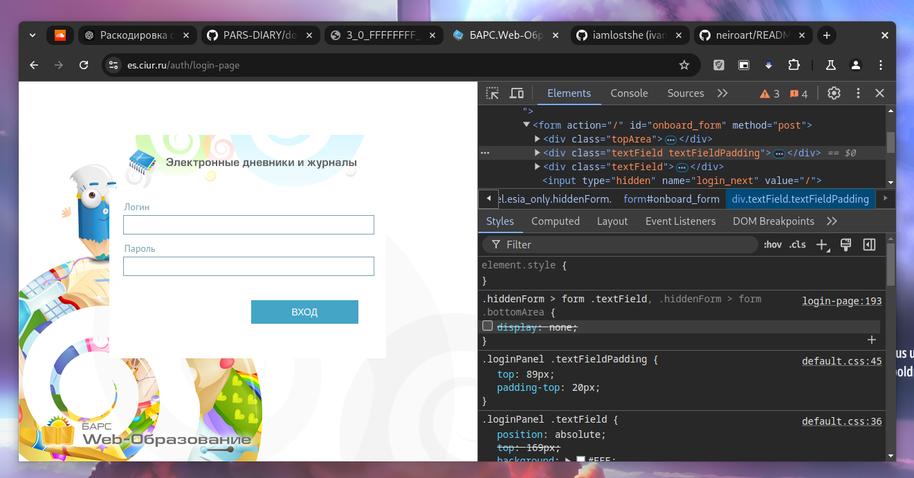
>
> Если мы попытаемся авторизоваться старым способом - как ни странно отправится запрос к бэкенду. И если пароль и логин верные произойдёт авторизация.
>
> 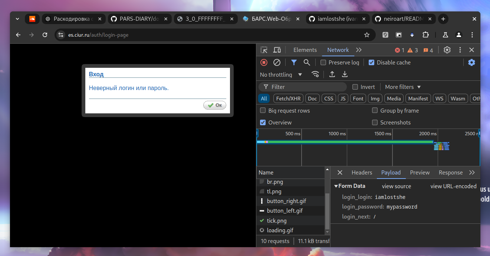
>
> Решение проблемы очень простое: удалить этот элемент, а не скрыть.
>
> Почему разработчики так не сделали для меня остаётся загадкой...
>
> Можно предположить, что они хотели сохранить этот код, но в таком случае наилучшим решением будет использоание `GIT` репозитроия (инструмента для контроля версий), чтобы в случае чего можно было отктиться к предыдущей версии.

## 3.2 Дизайн и интерфейс

1. **Сайт**. Нет поддержки нестандартных разрешений экранов (сверстан не адаптивно), из-за этого появляются подобные неприятности (на фото ниже обрезан интерфейс, будет так же плохо отображаться на телефоне):


2. **Приложение**. Яркий задний фон приложения мешает восприятию информации, нет темной темы. Мне пришлось чуть-чуть доработать приложение под мои требования:

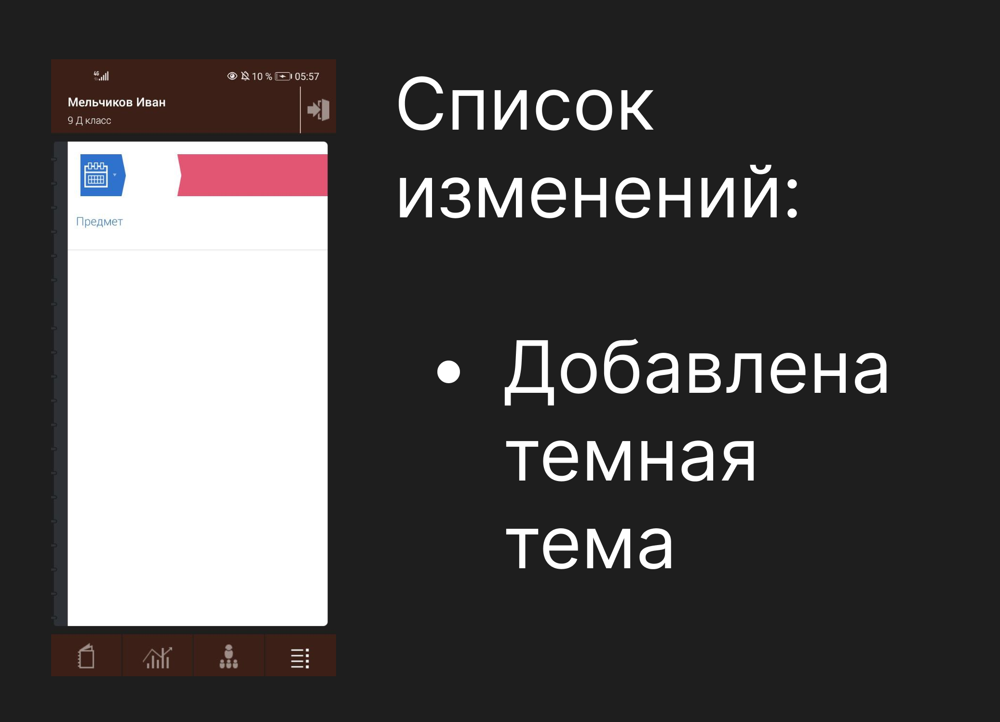

Оказалось, что не одного меня это раздражало. Немного погуглив я наткнулся на [обсуждение](https://4pda.to/forum/index.php?showtopic=991084) приложения на форуме 4PDA, где люди еще с 2018 года обсуждали проблемы приложения и модифицировали его.

3. **Приложение**. У компании есть приложение для **iPhone/iPad** и **Android**. Они существенно отличаются в плане *дизайна*. Зачем? Непонятно! (Видимо разработчикам чем-то не угодили владельцы яблочных телефонов)


По комментариям приложения в [AppStore](https://apps.apple.com/ru/app/id557094374) можно заметить что пользователи недовольны дизайном:

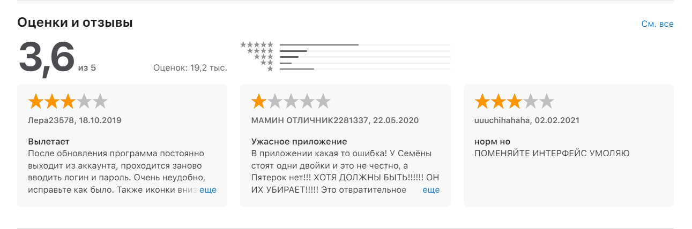

## 3.4 Функционал

1. **Приложение "выбрасывает" из аккаунта, после чего снова приходится проходить авторизацию**.

Рассмотрим ситуацию, когда пользователь хочет быстро посмотреть оценки, но ему приходится вводить длинный пароль от госуслуг, проходить двухфакторную аутентификацию.

> **Это происходит из-за устаревания** `cookie`.
>
> Решено в боте и точно может быть решено в приложении.
>
> Путем запроса к API, каждый час (реализовано для проверки изменений => отправки уведомлений) и тем самым продления срока жизни `cookie`.

2. **Отсутствие уведомлений**.

Эта функция *условно* реализована в приложении, но судя по всему поддерживается не во всех регионах (по крайней мере не работает в **Удмуртской республике**).

> Предположим, им не хватает серверной мощности, чтобы предлагать подобный функционал на сайте.
>
> Но можно сделать локальное сравнение кеша с актуальными данными, что и реализовано в боте.

В отзывах (полученных по схеме описаной в `3.0 Результаты опросов`) уведомления упоминаются 554 раза.

В том же [обсуждение](https://4pda.to/forum/index.php?showtopic=991084) приложения на форуме 4PDA один из пользователей [интересуется](https://4pda.to/forum/index.php?showtopic=991084&view=findpost&p=125485721) отсутсвием функционала уведомлений:

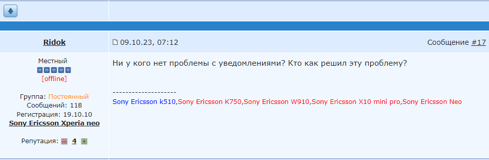

## 3.5 Реклама

### Сайт

Как минимум с 2018 по 2020 год на странице регистрации "висело" до 4-х баннеров.


Вот, кстати, [виджет](https://informer.yandex.ru/informer/34918860/3_0_FFFFFFFF_EFEFEFFF_0_pageviews) со статистикой (всего за день) на сайте на тот момент:

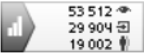

|                       |       |
| --------------------- | ----- |
| просмотры             | 53512 |
| визиты                | 29904 |
| уникальные посетители | 19002 |

> Сейчас при попытке перейти по виджету
> он выдает нули, что неудивительно, ведь он больше не используется на сайте (по крайней мере не отображается).
>
> 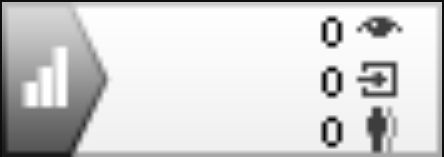
>
> Но у нас есть [архивня копия](https://web.archive.org/web/20190301141109im_/https://informer.yandex.ru/informer/34918860/3_0_FFFFFFFF_EFEFEFFF_0_pageviews) виждета.

> Сейчас используется счётчик от LiveInternet, о чем говорит следующий код на странице сайта:
>
> 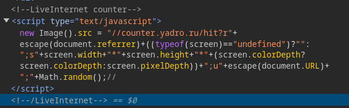
>

> Интересно, что о приемуществах размещения рекламы на сайте ciur.ru
> была статья на сайте `РЕГИОНАЛЬНОГО ЦЕНТРА ИНФОРМАТИЗАЦИИ по УР`, которая сейчас к сожалению недоступна.
>
> 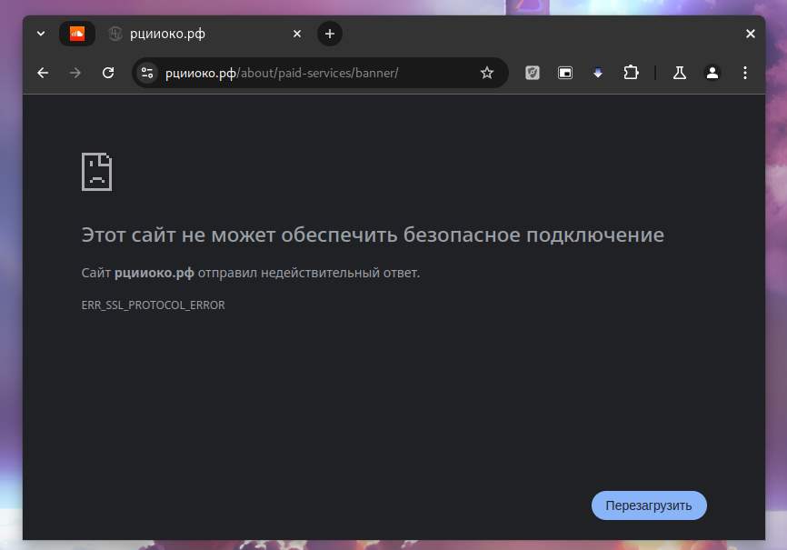
>
> Но, мы имеем архивную копию:
>
> https://web.archive.org/web/20200929111327/https://%D1%80%D1%86%D0%B8%D0%B8%D0%BE%D0%BA%D0%BE.%D1%80%D1%84/about/paid-services/banner/
>
> **Изменено:**
>
> Интересно также то, что сайт [рцииоко.рф](https://рцииоко.рф)
> заблокирован на территории РФ по требованию РКН)
> 
> 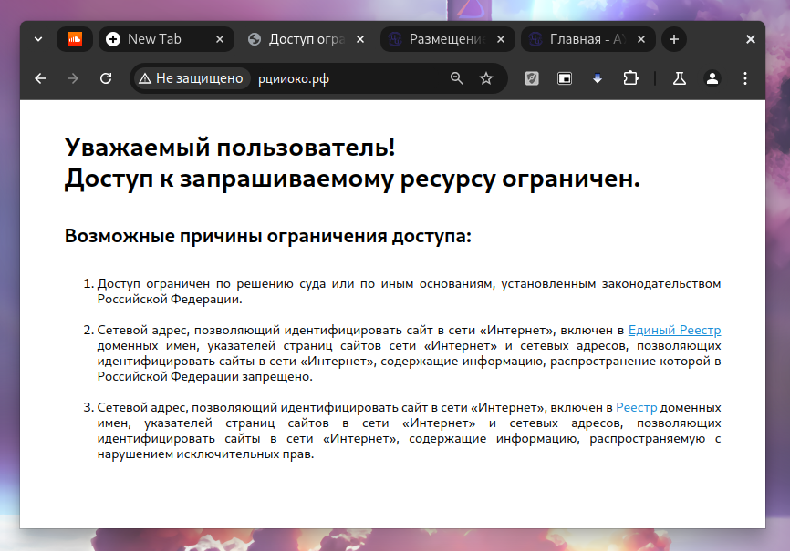
>
> НО открывается из Франции (впн):
>
> 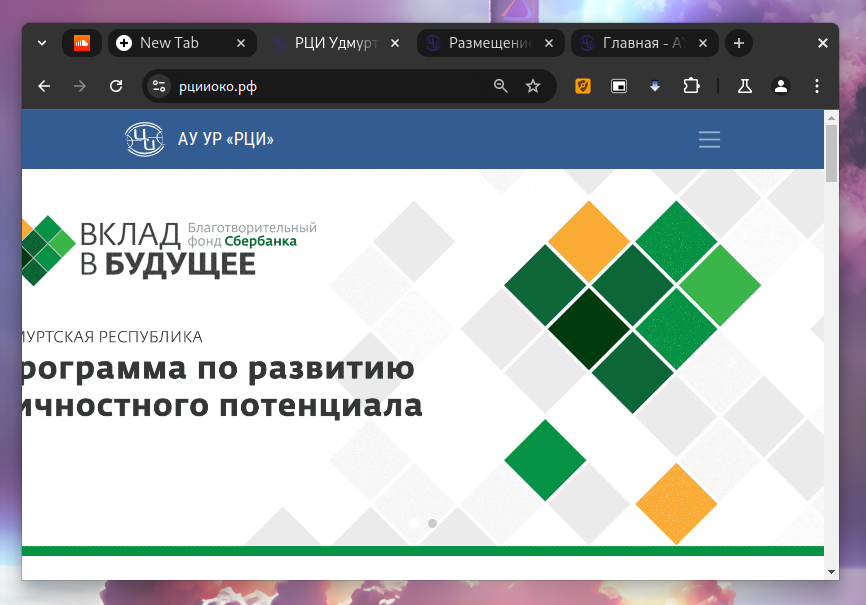
>
> Таким образом мы можем просмотреть указаную ранее
> [статью](https://xn--h1aagpbh6b.xn--p1ai/about/paid-services/banner/)
>
> 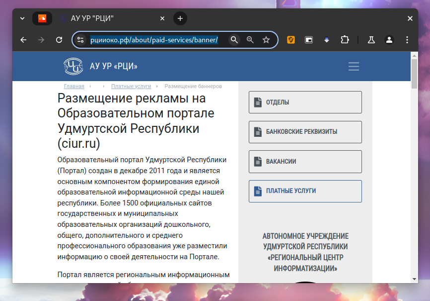
>
> [Резервная копия страницы](res/site_reserve_copy.html)
>
> На странице имеются ссылки на размещение рекламы:
>
> 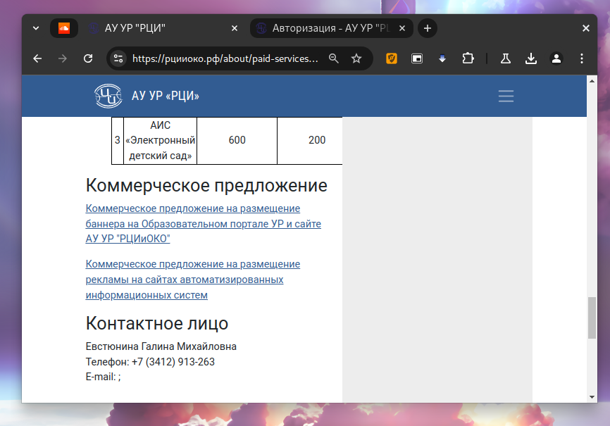
>
> - [КП Регламентация на ОП УР и сайтах.docx](https://xn--h1aagpbh6b.xn--p1ai/informatization-of-education/monitoring/instructions/%CA%CF%20%D0%E5%EA%EB%E0%EC%E0%20%ED%E0%20%CE%CF%20%D3%D0%20%E8%20%F1%E0%E9%F2%E0%F5.docx)
> - [КП Размещение на входе в АИС 2020.doc](https://xn--h1aagpbh6b.xn--p1ai/informatization-of-education/monitoring/instructions/%CA%CF%20%F0%E0%E7%EC%E5%F9%E5%ED%E8%E5%20%ED%E0%20%E2%F5%EE%E4%E5%20%E2%20%C0%C8%D1%202020.doc)
>
> Но они не работают:
>
> 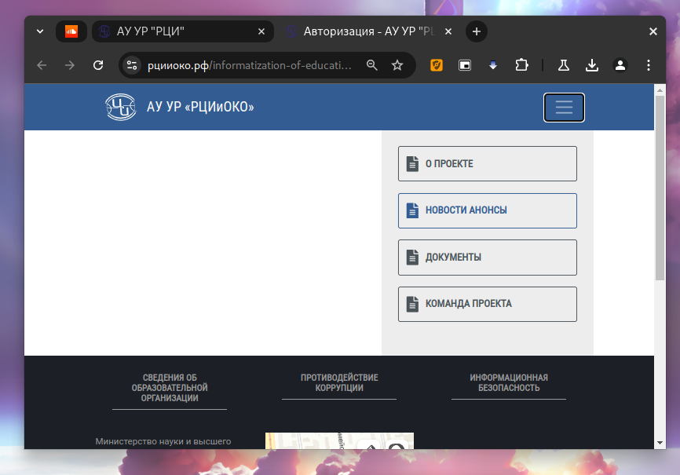

### Приложение

В процессе анализа приложения для устройств под управлением ОС Android на предмет URI, API-эндпоинтов с помощью скрипта [apkleaks](https://github.com/dwisiswant0/apkleaks) были замечены ссылки:

```
https://pagead2.googlesyndication.com/pagead/gen_204?id=gmob-apps
```

Эти URL-адреса, относится к Google AdSense и используется для отслеживания и управления рекламой в мобильных приложениях. Конкретно, это может быть частью системы, которая отвечает за показ рекламы, сбор статистики о кликах и взаимодействиях с рекламой, а также за другие функции, связанные с монетизацией приложений.

```
https://www.googleadservices.com/pagead/conversion/app/deeplink?id_type=adid&sdk_version=%s&rdid=%s&bundleid=%s&retry=%s
```

`google ad services` в дословном переводе - рекламные сервисы google.

1. **id_type=adid**: Указывает, что идентификатор, который будет использоваться для отслеживания, является рекламным идентификатором (Advertising ID).

2. **sdk_version=%s**: Этот параметр, вероятно, будет заменен на версию SDK, используемую в приложении. Это может помочь Google Ads определить, какая версия SDK используется для отслеживания.

3. **rdid=%s**: Этот параметр может представлять собой уникальный идентификатор устройства или пользователя, который будет заменен на конкретное значение при выполнении запроса.

4. **bundleid=%s**: Этот параметр указывает на идентификатор пакета приложения (например, com.example.app), что позволяет Google Ads связать событие с конкретным приложением.

5. **retry=%s**: Этот параметр может использоваться для указания количества попыток повторного выполнения запроса или для других целей, связанных с обработкой ошибок.

Реклама в приложении хоть и не показывается (по крайней мере на данный момент и на моих устройствах), но она зашита в его код. Возможно не доработана или отключена. 

## 3.6 Сервера

В конце каждой четверти, когда наблюдается огромный онлайн на сервере, потому что много учителей одновременно выставляют оценки сервер уходит на тех. работы, это обусловлено плохой оптимизацией серверной части.

Упадет ли мой бот в это время? Зачастую они просто ограничивают вход на платформу, но не использование API. Но в зависимости от нагрузки API также может упасть и бот будет выдавать ошибку: "Сервер не отвечает"

## 3.7 Обновления

По архивным копиям сайта можно было заметить что за настолько долгое время почти ничего не изменилось. Я связываю такую частоту обновлений с тем, что это коммерческий проект.

Если бы это развивалось как хобби, например, как мой бот, то обновления выходили бы чаще, уже давно не было бы выше описанных уязвимостей, багов и недоработок.
